# PiPulse

**Watch a handful of Raspberry Pis from one dashboard, and stop any one program from starving
a Pi of CPU or memory.**

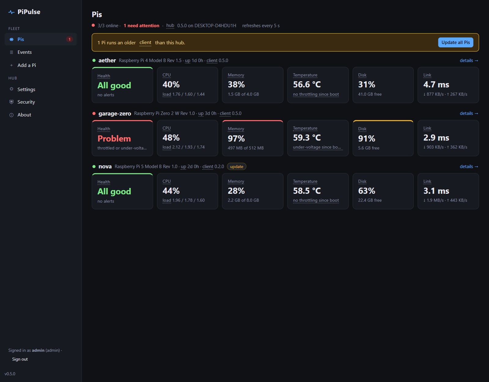

PiPulse is two small programs:

- **PiPulse Hub** lives on one Pi. It serves the web dashboard and keeps the history, settings,
  alerts and event log. It mirrors and backs up to your NAS, and it monitors its own Pi too.
- **PiPulse Client** goes on every Pi you want to watch. It reports to the hub every few seconds
  over an encrypted link and carries out what you ask from the dashboard: limits, restarts,
  OS updates, reboots. It is capped at 10% CPU and 48 MB of RAM (it uses about 25 MB), so the
  monitor itself can never be what slows a Pi down.

Both are plain Python 3 standard library: no pip, no Docker, no cloud, nothing to compile.
Raspberry Pi OS Lite already has everything they need. The dashboard is a
[Bracket](https://github.com/AxialForge/bracket) app, the same frame as MediaLedger and
Linewatch.

**How it all fits together, in detail: [docs/HOW-IT-WORKS.md](docs/HOW-IT-WORKS.md).**

---

## A tour

### Every Pi at a glance

The **Pis** page (above) shows a row of tiles per Pi: health, CPU, memory, temperature, disk and
link latency. A red or amber edge marks anything that needs attention, and the page refreshes
every 5 seconds. Alerts only fire after a problem has lasted a while (60 s by default), so a
short spike never pages you.

### One Pi in depth

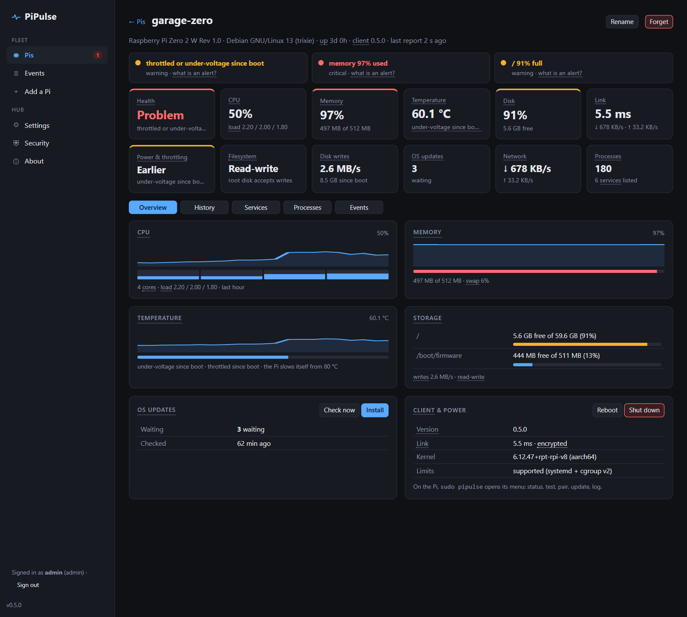

Each Pi has its own page, laid out like Bracket's System page:
- **Alerts** at the top.
- **A second row of tiles:** power and throttling, the filesystem, disk writes (SD wear),
  waiting OS updates, network and processes.
- **Five tabs:**
  - **Overview**: CPU per core, memory, temperature and storage cards, **Install** for OS updates,
    **Reboot** and **Shut down**.
  - **History**: charts from 1 hour to 1 year. Full detail for a week, hourly averages for a
    year, and everything older in the NAS archive.
  - **Services**: every systemd service by CPU and memory, with **Watch**, **Limit** and
    **Restart**.
  - **Processes**: the busiest programs, with **Nice**.
  - **Events**: this Pi's log.

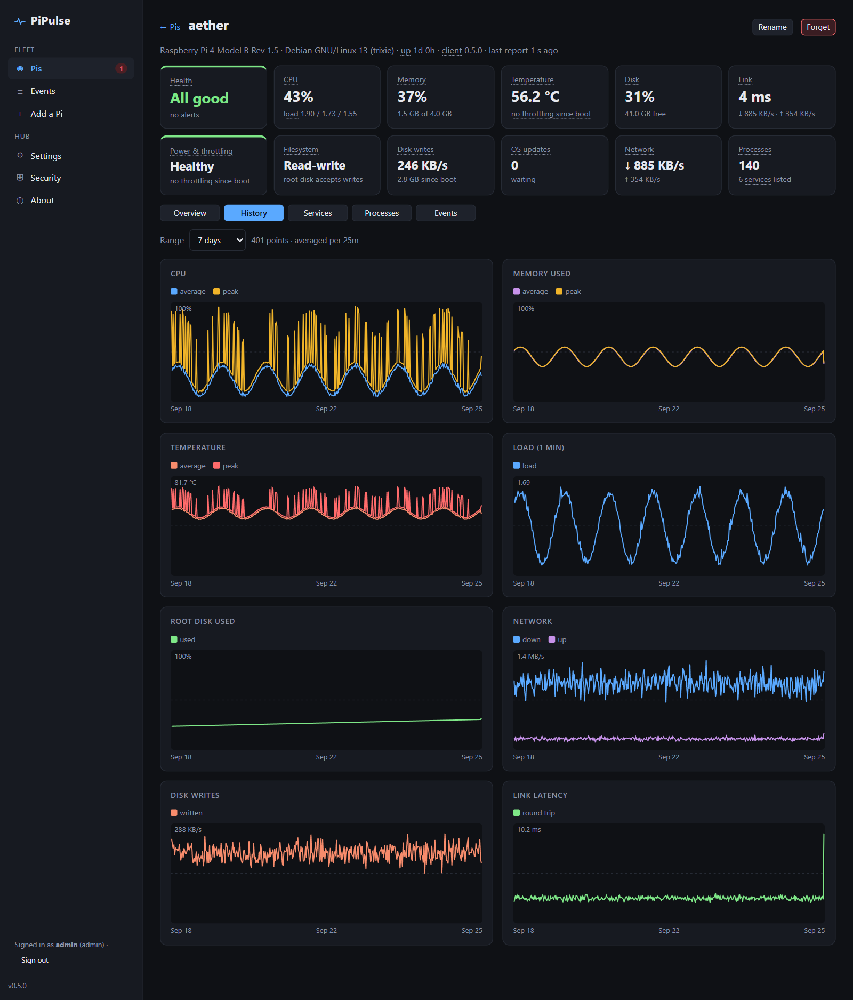

### Keep one program from starving a Pi

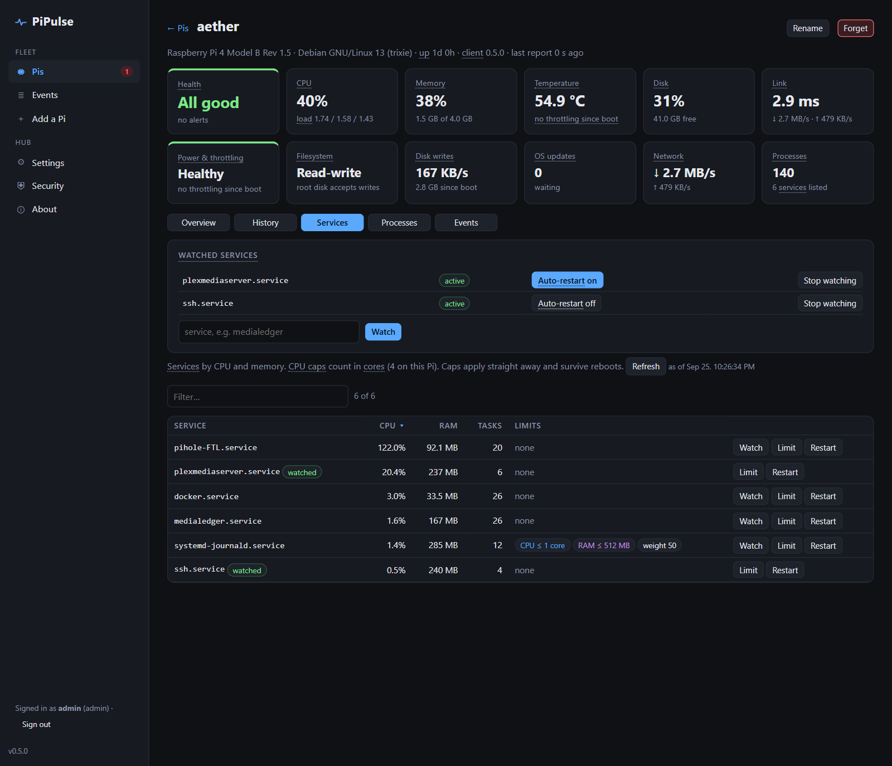

- **Limit** caps a service's CPU (in cores), its memory, or its priority. systemd enforces it
  (`systemctl set-property`). It survives reboots and doesn't change the program. Near the
  memory cap the service is slowed down; past it, systemd restarts that service instead of the
  whole Pi freezing.
- **Watch** raises an alert when a service stops. With **auto-restart**, the hub restarts it,
  at most 3 times an hour, then it tells you it gave up.
- **Guard rules** (Settings) do the capping automatically: "any service above 150% CPU for 5
  minutes gets capped at 1 core". They never touch SSH, systemd's core services or PiPulse.

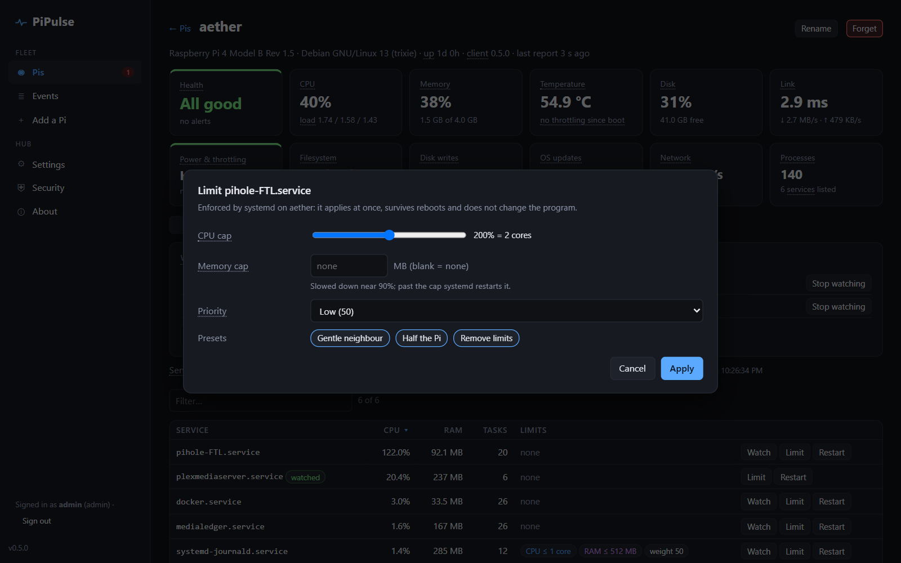

### Every term explained

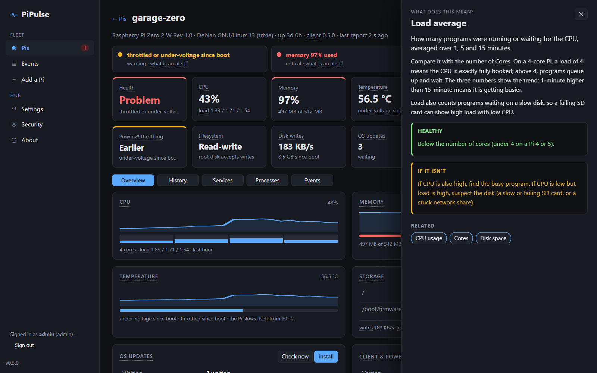

Words like *load average*, *swap*, *throttling*, *CPU cap* or *token* have a dotted
underline. **Hover** for a one-line meaning, or **click** for a panel covering what it is, what
healthy looks like, what to do if it isn't, and related terms. About 45 PiPulse terms sit on top
of the Bracket kit's own.

### Events, adding Pis, settings

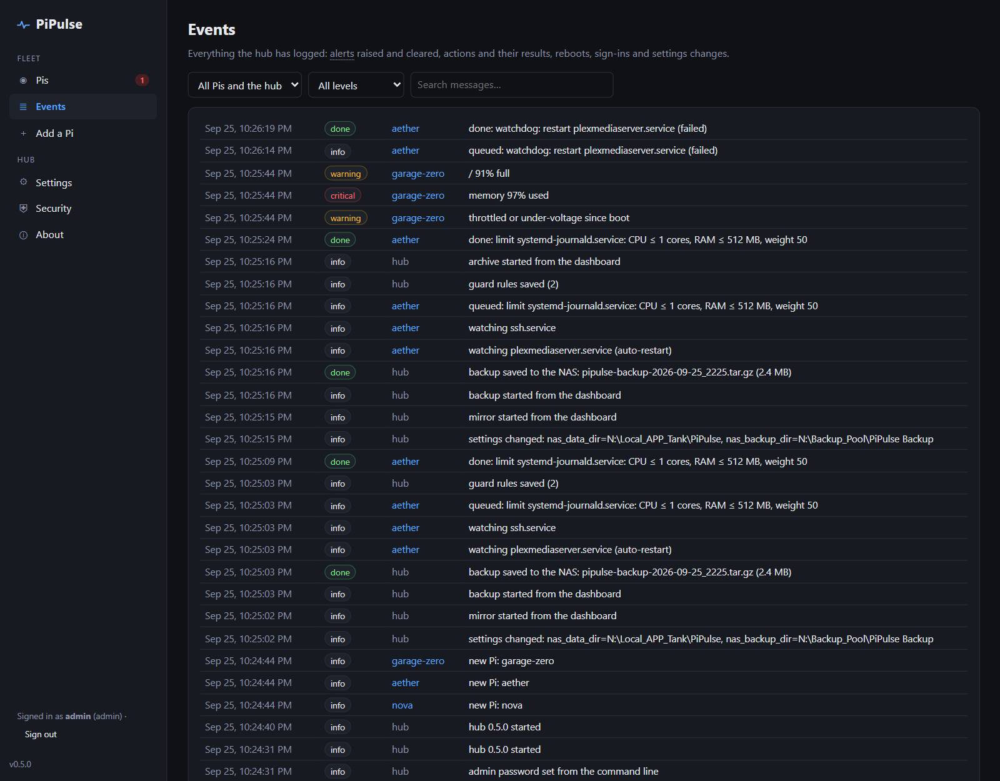

**Events** lists everything the hub logged: alerts raised and cleared, actions and their results,
reboots ("rebooted, not from PiPulse" when nobody asked), sign-ins and settings changes. You can
filter it by Pi and level, and search it.

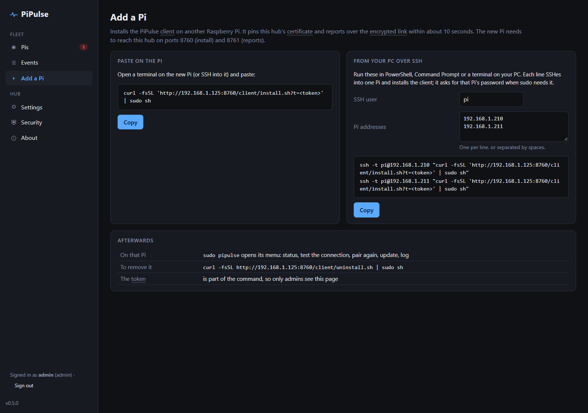

**Add a Pi** gives you the one-line install command for a new Pi. The **From your PC over SSH**
side turns a list of addresses into `ssh -t user@pi "…"` lines to paste into PowerShell.

<details><summary><b>Settings</b>: thresholds, history, NAS storage, guard rules, encryption, theme (click to expand)</summary>

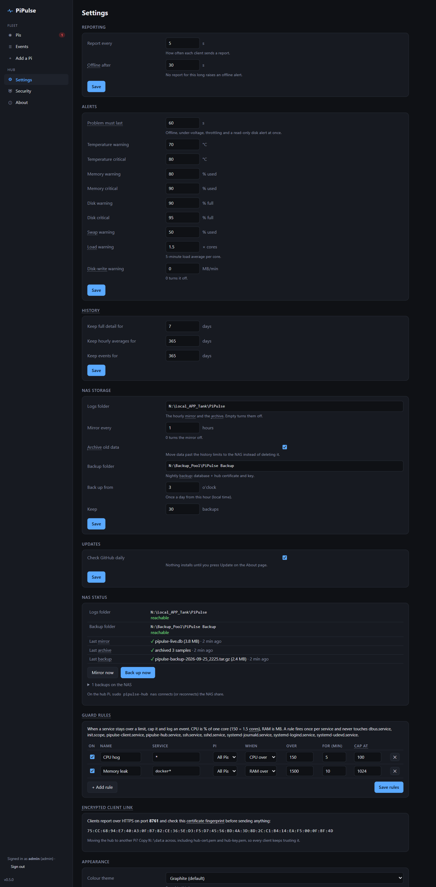

</details>

<details><summary><b>Security</b> and <b>About</b> (click to expand)</summary>

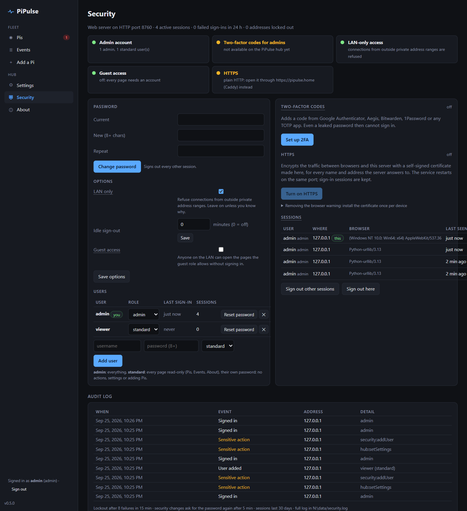
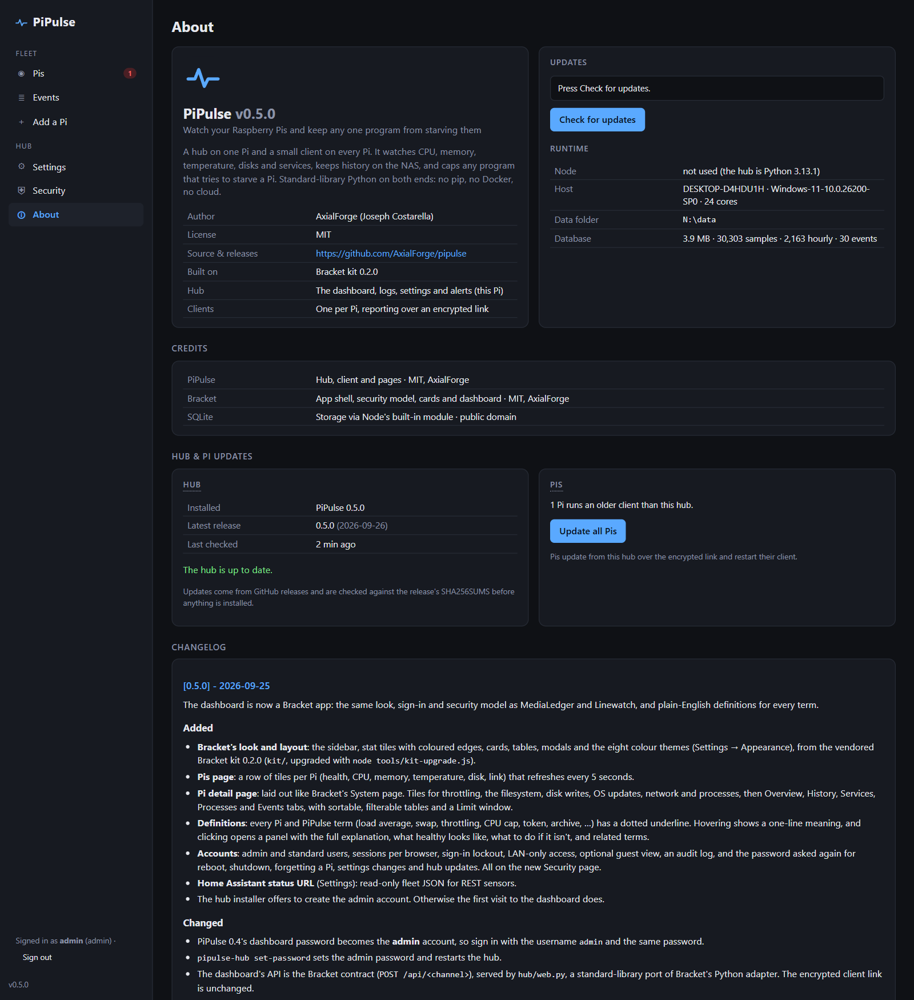

</details>

<details><summary><b>On a phone</b> (click to expand)</summary>

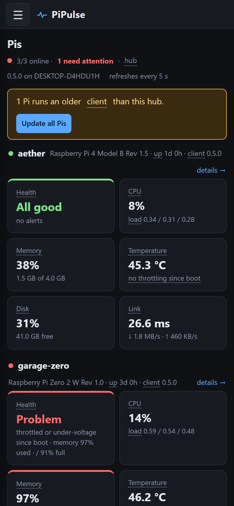

</details>

---

## Install

### The hub

On the Pi that will be the hub:

```bash
curl -fsSL https://github.com/AxialForge/pipulse/releases/latest/download/install-hub.sh | sudo sh
```

It installs the `pipulse-hub` service (dashboard on port **8750**, encrypted client link on
**8751**) and a client for the hub Pi itself. It offers to create the dashboard's **admin**
account and to connect the NAS, then prints the dashboard address. If you skip the account,
the first visit to the dashboard creates it.

For `https://pipulse.home`, put Caddy in front (`reverse_proxy 127.0.0.1:8750`). Only the
dashboard goes through Caddy; the client link on 8751 stays direct.

### More Pis

In the dashboard, **Add a Pi** shows a command like:

```bash
curl -fsSL 'http://<hub>:8750/client/install.sh?t=<token>' | sudo sh
```

Run it on the new Pi (or use the SSH lines from your PC), and the Pi appears within about 10
seconds. Clients always install from your hub, so their version matches it.

On any client Pi, `sudo pipulse` opens a small menu with these options:
- status
- test the connection
- pair with a hub, after checking its certificate fingerprint
- update
- log
- restart
- uninstall

### Updating

The hub checks GitHub daily. **About → Update hub** installs a new release, after checking it
against the release's SHA256SUMS. Then **Update all Pis** brings the clients along over the
encrypted link.

Re-running the install line over SSH does the same:

```bash
ssh -t <user>@<hub-pi> "curl -fsSL https://github.com/AxialForge/pipulse/releases/latest/download/install-hub.sh | sudo sh"
```

The database, accounts, token and certificate are kept, so every client keeps working.

### NAS storage and backups

`sudo pipulse-hub nas` on the hub Pi mounts the NAS share at `/mnt/pipulse` (at the share
prompt, press Enter for the default).

| What | Where | When |
|---|---|---|
| Database mirror (`pipulse-live.db`) | `Local_APP_Tank\PiPulse` | every hour |
| Archive of everything past the history limits (daily `.csv.gz`) | `Local_APP_Tank\PiPulse\archive` | hourly |
| Backup: database + hub certificate and key | `Backup_Pool\PiPulse Backup` | nightly from 3:00, newest 30 kept |

To restore: `sudo pipulse-hub restore "/mnt/pipulse/Backup_Pool/PiPulse Backup/<file>"`.

### The `pipulse-hub` command

| Command | What it does |
|---|---|
| `status` | Hub and local client service status |
| `nas` | Connect (or reconnect) the NAS |
| `restore FILE` | Restore a backup (current data is moved aside, not deleted) |
| `set-password` | Set or reset the admin password (restarts the hub) |
| `log` | Recent hub log |
| `update-log` | Log of the last update from the dashboard |

### Remove

- Client: `curl -fsSL http://<hub>:8750/client/uninstall.sh | sudo sh`
- Hub: `curl -fsSL http://<hub>:8750/hub/uninstall.sh | sudo sh`. Add `-s -- --purge` to also
  delete its data. Nothing on the NAS is ever touched.

---

## Security in short

- **Reports are encrypted and the hub can't be impersonated.** The hub makes its own
  certificate. Each client pins its fingerprint at install and refuses anything else. No
  certificate authority, nothing that costs money or expires.
- **The dashboard** uses Bracket's model:
  - admin and standard accounts
  - lockout after 8 failed sign-ins
  - LAN-only access, and guest view off
  - the password asked again for reboot, shutdown, forgetting a Pi, settings changes and hub
    updates
  - an audit log
- **Don't port-forward it.** Open it through Caddy for HTTPS, and use your router's VPN from
  outside.

Details, and why each choice was made, are in [HOW-IT-WORKS.md](docs/HOW-IT-WORKS.md#security).

---

## Develop

```bash
python hub/hub.py                  # dev hub on this PC (needs openssl; Git for Windows' copy works)
python tools/demo.py               # three fake Pis (aether, nova, garage-zero) over the real encrypted link
python tools/demo.py --backfill    # 30 days of fake history for them (restart the hub afterwards)
python -m unittest discover tests  # 51 tests: end-to-end hub, web security, NAS, guards, glossary
python tools/package.py            # release assets into dist/
node tools/screenshots.js          # re-take docs/screenshots from a running hub (headless Edge/Chrome)
node tools/kit-upgrade.js --from ../Bracket   # show / --apply a newer Bracket kit into kit/
```

`tools/screenshots.js` signs in with `PIPULSE_SHOT_PASSWORD` and replaces the install token with
`<token>` before it captures anything. The demo honours `PIPULSE_DEMO_DATA` and
`PIPULSE_DEMO_LINK_PORT`, so a screenshot hub can run beside the normal dev hub.

The pages are in `hub/web/` (`app.js`, `terms.js` for the definitions). `kit/` is Bracket's
kit, vendored whole and never edited here; the hub ships only its `renderer/`. The project
guide for working on the code is [CLAUDE.md](CLAUDE.md).

Releases: bump `VERSION`, update `CHANGELOG.md`, tag `vX.Y.Z` and push. CI runs the tests on
Python 3.11 and 3.13, packages, and attaches `install-hub.sh`, `pipulse-hub.tar.gz`,
`pipulse-client.py` and `SHA256SUMS` to the release.

## Roadmap

- Notifications: phone push (ntfy), Home Assistant (MQTT discovery), email.
- HTTPS for the dashboard without Caddy; per-client keys.

MIT licence · made by AxialForge
