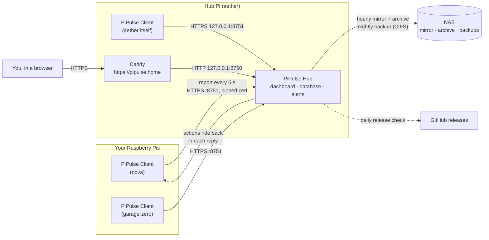
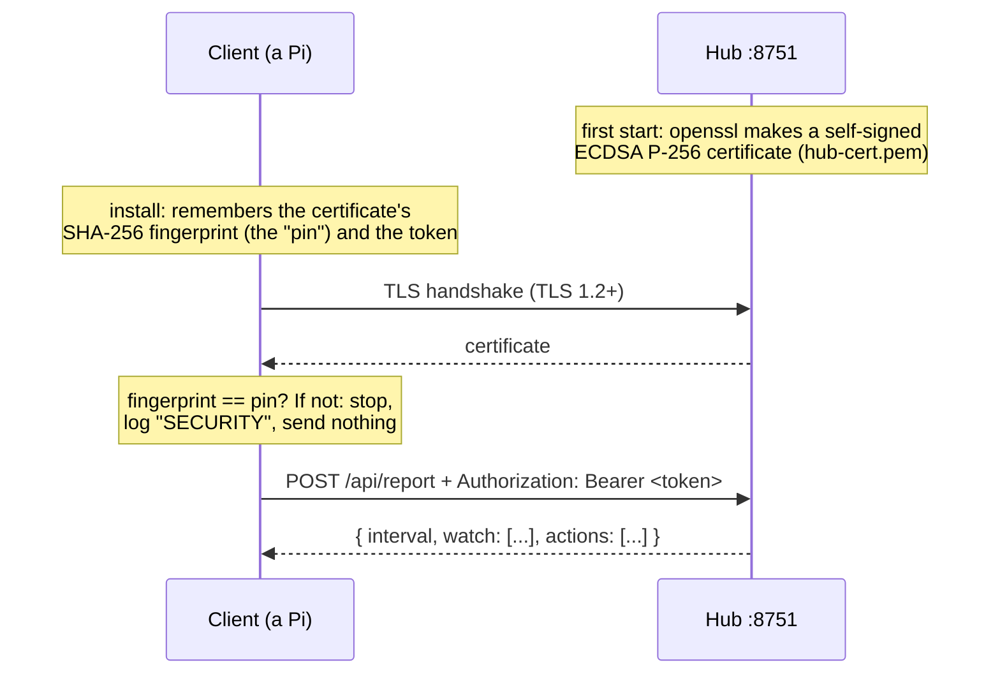
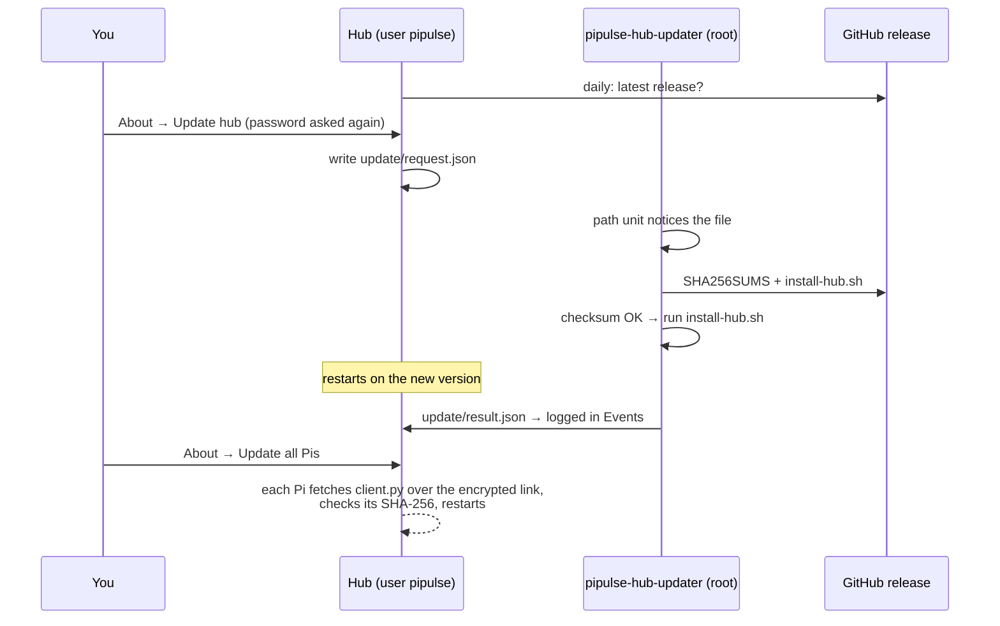

# How PiPulse works

This is the full picture: what runs where, what each part measures and stores, how the
encryption, alerts, limits, storage, accounts and updates work, and why each was built that way.
For installing and a tour with screenshots, see the [README](../README.md).

- [The big picture](#the-big-picture)
- [The client (on every Pi)](#the-client-on-every-pi)
- [The encrypted link](#the-encrypted-link)
- [The hub](#the-hub)
- [Alerts](#alerts)
- [Keeping a program from starving a Pi](#keeping-a-program-from-starving-a-pi)
- [History, storage and the NAS](#history-storage-and-the-nas)
- [The dashboard](#the-dashboard)
- [Security](#security)
- [Updates](#updates)
- [What lives where on a Pi](#what-lives-where-on-a-pi)
- [Troubleshooting](#troubleshooting)

---

## The big picture

A few principles shape everything else:

- **Pis never listen.** Every connection goes from a client *to* the hub. Commands for a Pi
  (limit this, reboot, update) are queued on the hub and ride back in the reply to that Pi's
  next report. No Pi has an open port for PiPulse.
- **The monitor must be cheap.** The client runs under `Nice=10 CPUQuota=10% MemoryMax=48M` and
  uses about 25 MB. It reads `/proc` and `/sys` directly instead of running programs, and does
  anything heavy (apt) outside its own box.
- **Standard library only.** Hub and client are plain Python 3. The dashboard is the Bracket
  kit's plain JavaScript, with no build step. Everything installs on a bare Pi OS Lite with one
  `curl | sudo sh`.
- **The SD card is precious.** The hub buffers samples and writes them every 30 seconds, not on
  every report, and the live database never lives on the NAS.

---

## The client (on every Pi)

A single file, `/opt/pipulse-client/client.py`, run by the `pipulse-client` systemd service.
Every report interval (5 s by default; the hub can change it in its reply), it samples the Pi
and sends one JSON report.

### What it measures

| Measurement | Where it comes from | How often |
|---|---|---|
| CPU total and per core | `/proc/stat` deltas | every report |
| Load average (1/5/15 min) | `/proc/loadavg` | every report |
| Memory, swap | `/proc/meminfo` (`MemAvailable`, so disk cache doesn't count as used) | every report |
| SoC temperature | `/sys/class/thermal/thermal_zone*/temp` (the hottest) | every report |
| Throttling / under-voltage flags | `vcgencmd get_throttled` (a subprocess, so rarely) | every 30 s |
| Disks (space) | `/proc/mounts` + `statvfs`, local filesystems only (a dead network mount can't hang it) | every report |
| Disk reads/writes (SD wear) | `/proc/diskstats`, whole disks (SD, USB SSD, NVMe), not partitions | every report |
| Root filesystem read-only? | the `ro` flag on `/` in `/proc/mounts` | every report |
| Network in/out | `/proc/net/dev`, all interfaces but loopback | every report |
| Busiest processes | `/proc/<pid>/stat`: the top 10 by CPU plus the top 10 by memory, with user, command and service | every report |
| Services | the cgroup v2 tree under `/sys/fs/cgroup/system.slice`: CPU, memory, tasks and current limits per service (top 25 plus any with limits) | every report |
| Watched services' state | `systemctl is-active` for the services the hub asked it to watch | every 15 s |
| Waiting OS updates | `apt-get -s upgrade` in its own systemd unit (see below) | every 6 h, and after an upgrade |
| Link latency | how long its previous report took to be answered | every report |
| Boot ID | `/proc/sys/kernel/random/boot_id`, which changes on every boot | at start |

### What it can be asked to do

Each action is checked twice: the hub validates it before queueing it, and the client
validates it again (unit-name pattern, value ranges, checksums) before doing it.

| Action | How the client does it |
|---|---|
| Limit a service | `systemctl set-property <unit> CPUQuota= MemoryMax= MemoryHigh= CPUWeight=` (see [limits](#keeping-a-program-from-starving-a-pi)) |
| Nice a process | `setpriority()` on that PID |
| Restart a service | `systemctl restart <unit>` |
| Reboot / shut down | `systemd-run --on-active=5 systemctl reboot` (or `poweroff`), delayed so the result reaches the hub first |
| Install OS updates | `apt-get update && apt-get upgrade` in a transient unit `pipulse-apt-upgrade`, with `Nice=10` and idle I/O priority |
| Check for OS updates | re-runs the apt check now |
| Update itself | downloads `client.py` from the hub over the encrypted link, checks its SHA-256 against the one the hub sent, replaces itself, then exits once the result is delivered; systemd starts the new version |

**Why apt runs in its own unit:** everything the client starts inherits its 10% CPU / 48 MB box.
apt inside that box would crawl, then get killed for using too much memory, possibly taking the
client with it. `systemd-run` gives apt its own unit (the check is capped at 50% CPU and 300 MB).

### `sudo pipulse`: the menu on each Pi

`/usr/local/bin/pipulse` opens an arrow-key menu (a numbered list when there's no proper
terminal):

- **Status**: service state, hub address, last report and round-trip time, and the pinned
  fingerprint.
- **Test the connection**: reaches the hub, compares its certificate with the pin, and checks
  the token.
- **Pair with a hub**: enter the hub address and token. It shows the hub's certificate
  fingerprint so you can compare it with the one in the dashboard's Settings, and only saves if
  you confirm. Use this to re-point a Pi at a moved or reinstalled hub.
- **Update, log, restart, uninstall.**

The menu reads the client's status from `/run/pipulse-client.json`. `/run` is in memory, so
writing that file every report costs the SD card nothing.

---

## The encrypted link

- **No certificate authority.** The hub's certificate is its own. Trust comes from the client
  pinning the certificate's exact fingerprint at install time. Nothing costs money, and nothing
  expires in a way that matters, because the pin, not the validity date, is what's checked.
- **The pin is checked before a byte of the report is sent.** A different server on the
  network, or a hub reinstalled without its old key, gets nothing.
- **The token** proves a client belongs to this hub. It only ever travels inside the encrypted
  link, and it's shown only to admins (it is part of the Add a Pi command).
- **The dashboard port (8750) refuses reports.** `/api/report` there needs a signed-in session,
  so there is no unencrypted way in.
- The hub does each TLS handshake in that connection's own thread, so one stalled Pi can't hold
  up the others.

**Installing a client** runs `install.sh` from the hub. The hub fills in its own address,
the ports, the token, the fingerprint and the SHA-256 of the client file, and the installer
refuses a download that doesn't match.

---

## The hub

`/opt/pipulse-hub/hub/hub.py`, run by `pipulse-hub` as the unprivileged `pipulse` user in a
systemd sandbox (`ProtectSystem=strict`, writing only to `/var/lib/pipulse` and the NAS
mount), capped at `CPUQuota=25% MemoryMax=160M`. It uses about 33 MB.

| Part | File | Job |
|---|---|---|
| Client link | `hub.py` (`LinkHandler`) | HTTPS on :8751; takes reports, hands back actions |
| Report handling | `hub.py` (`Hub.report`) | stores the sample, runs the alert rules, watchdog and guard rules, detects reboots, collects action results |
| Upkeep loop | `hub.py` (`Hub.maintain`) | every 5 s: offline check; every 30 s: write buffered samples; every 5 min: hourly roll-ups; NAS and update jobs when due |
| Storage | `store.py` | SQLite: settings, Pis, samples, hourly averages, events, sessions |
| Alerts | `alerts.py` | turns measurements into alerts that are raised and cleared |
| Guard rules | `guards.py` | automatic caps for services that stay hot |
| NAS | `nas.py` | mirror, archive, backup |
| Updates | `updater.py` | the GitHub release check and the request to the root updater |
| Certificate | `tls.py` | makes the certificate once; fingerprint |
| Dashboard | `web.py` + `web/` | the Bracket contract, accounts and security, and the pages |

When a report arrives:
1. The hub notes the Pi (and logs "new Pi" the first time).
2. If the boot ID changed, it logs a reboot. It says "from the dashboard" if you pressed
   Reboot in the last 15 minutes, otherwise "not from PiPulse".
3. It buffers the sample.
4. It evaluates the alert rules.
5. It restarts watched services that stopped, when auto-restart is on.
6. It checks the guard rules.
7. It logs the results of earlier actions.
8. It replies with the report interval, the services to watch, and any queued actions.

An action sent but not answered within a minute is logged as lost.

---

## Alerts

A condition becomes an **alert** only after it has lasted the "problem must last" time (60 s by
default), so a short spike doesn't page you. The exceptions are the conditions marked
*at once* below. Every alert is written to Events when it is raised and again when it clears.
If a warning gets worse to critical while it's active, it is raised again at the new level.

| Alert | Default threshold | Level |
|---|---|---|
| Offline | no report for 30 s | critical, at once |
| Temperature | 70 °C warning, 80 °C critical | |
| Under-voltage now | firmware flag | critical, at once |
| Throttled now | firmware flag | critical, at once |
| Throttled or under-voltage since boot | firmware flag | warning |
| Memory | 80% used warning, 90% critical | |
| Swap | 50% used | warning |
| Disk (each local filesystem) | 90% full warning, 95% critical | |
| Root filesystem read-only | usually a failing SD card | critical, at once |
| Disk writes | above N MB/min (off by default) | warning |
| Load | 5-minute load above 1.5 × cores | warning |
| Watched service stopped | state not active | critical |

All thresholds are in **Settings → Alerts**. Health on the Pis page rolls a Pi's active alerts
into one word: **All good**, **Attention** (warnings), **Problem** (anything critical) or
**Offline**.

Alert state lives in the hub's memory. After a hub restart, conditions that are still true are
raised again, so you may see a second "raised" event with no "cleared" before it. That's harmless.
Alerts go to the dashboard and Events; phone push, Home Assistant and email notifications are
next on the roadmap.

---

## Keeping a program from starving a Pi

All limits go through systemd (`systemctl set-property`), which writes small drop-in files under
`/etc/systemd/system.control/`. They apply at once, survive reboots, and never modify the
program. Transient units (`.scope`, such as Docker containers) get `--runtime` limits, because
systemd can't keep permanent settings for them.

| Control | systemd setting | Effect |
|---|---|---|
| **CPU cap** | `CPUQuota=` | the most CPU a service can use, in cores ("0.5 cores" = never more than half of one core) |
| **Memory cap** | `MemoryHigh=` at 90% of the cap, `MemoryMax=` at the cap | near the cap the service is slowed down and made to give memory back; past it, systemd restarts it instead of the whole Pi running out of memory |
| **Priority** | `CPUWeight=` | only matters when the CPU is fully busy: weight 200 gets twice the share of the default 100; Background 20 / Low 50 suit batch jobs |
| **Nice** (Processes tab) | `setpriority()` | lowers one process's priority until it restarts |

"Remove limits" sets the values back to empty. The drop-in files stay behind but hold nothing,
which is how systemd works.

**Watchdog.** Watch a service and the client checks it every 15 seconds. A stopped or failed
watched service raises a critical alert. With auto-restart on, the hub queues a restart, at most
once every 2 minutes and 3 times an hour. After the third try it logs that it gave up, because
a service that keeps dying needs a person.

**Guard rules.** A rule looks like this: *"a service matching `docker*` above 1500 MB for 10
minutes → cap it at 1024 MB"* (CPU rules use % of one core). When a rule fires:
- it queues an ordinary limit, keeping the service's other limits;
- it logs an event;
- it won't fire again for that service for 10 minutes, or at all if the service already has
  that kind of cap.

Guard rules never touch the services you need to get back in or to keep PiPulse working:
`ssh`, `sshd`, `dbus`, `systemd-journald`, `systemd-logind`, `systemd-udevd`, `init.scope`,
`pipulse-client` and `pipulse-hub`.

---

## History, storage and the NAS

### On the hub Pi

| Data | Kept | Where |
|---|---|---|
| Full-detail samples (every report) | 7 days | `samples` table |
| Hourly averages and peaks | 365 days | `hourly` table, recalculated every 5 min for the last 3 hours |
| Events | 365 days | `events` table |
| The last hour, for sparklines | in memory | refilled from the database on restart |

All in `/var/lib/pipulse/pipulse.db`: SQLite in WAL mode, with samples buffered and committed
every 30 s. History charts average the raw samples into about 400 points. Past the full-detail
window they switch to the hourly rows. Retention is set in **Settings → History**.

### On the NAS

The NAS never holds the live database: SQLite over SMB can corrupt, and logging would stop
whenever the NAS sleeps. Instead the hub copies to it:

| Job | What it writes | When |
|---|---|---|
| **Mirror** | `pipulse-live.db`: a consistent snapshot, made with `VACUUM INTO` locally, copied as `.partial`, then renamed so nobody sees half a file | every hour |
| **Archive** | rows about to pass the history limits, appended to `archive/<table>/<year>/<table>-<date>.csv.gz` (one file per day), plus `archive/nodes.csv` to map IDs to names; only then are they deleted from the Pi | hourly |
| **Backup** | `pipulse-backup-<date>_<time>.tar.gz`: the database, `hub-cert.pem`, `hub-key.pem`, the version and restore notes; keeps the newest 30 | once a day from 3:00 (catches up later that day if the hub or NAS was off at 3) |

- **Safety check:** before writing anything, the hub checks the target really is on the
  mounted share, meaning a different device from `/`. An unmounted mountpoint is just a folder
  on the SD card, and filling it would take the Pi down.
- **Failures:** a failed job is retried after 10 minutes and logged once in Events, not every
  time it fails.
- **NAS away:** the hub keeps rows it couldn't archive for up to a week (or one retention
  period, if longer). After that it deletes them with a warning, so the SD card never fills up.
- **Background thread:** NAS jobs run in their own thread, so a hung network share can't stall
  the hub.

**The mount.** `sudo pipulse-hub nas` does these steps:
1. installs `cifs-utils` if needed;
2. asks for the share (press Enter for `//192.168.1.204/Apocrypha_Main_Pool`) and the login,
   offering to reuse Linewatch's;
3. keeps the login in `/etc/pipulse/nas.cred` (readable by root only);
4. adds a `nofail` line to `/etc/fstab` that mounts at `/mnt/pipulse`, owned by the `pipulse`
   user;
5. creates and tests both folders;
6. installs `pipulse-nas-remount.timer`, which retries the mount every 10 minutes in case the
   NAS was asleep at boot.

It uses a plain mount, not systemd's automount, because the hub's sandbox can't reliably
trigger an automount.

**Restore.** `sudo pipulse-hub restore <file>` checks that the file is a PiPulse backup, stops
the hub, moves the current data to `pre-restore-<time>/`, extracts the backup and starts the
hub. Because the certificate and key come back too, every client keeps trusting the hub. The
same steps move a hub to a new Pi: install the hub there, then restore.

---

## The dashboard

The dashboard is a [Bracket](https://github.com/AxialForge/bracket) app. `kit/` is the Bracket
kit, vendored whole and never edited here. Its renderer draws the frame: sidebar, tiles, cards,
tables, modals, themes, the glossary, and the shared Security and About pages. PiPulse's own
pages are in `hub/web/app.js`.

The browser talks to the hub through one contract. Each page action calls a named channel
(`fleet:state`, `pi:get`, `pi:action`, `hub:setSettings`, …) as `POST /api/<channel>` with a
JSON array of arguments. `hub/web/bridge-shape.js` is the list of channels, and a test fails if
the pages and the hub ever disagree.

| Page | Shows |
|---|---|
| Pis | a row of tiles per Pi; refreshes every 5 s |
| A Pi | tiles, alerts, and the Overview / History / Services / Processes / Events tabs |
| Events | the whole log: filter by Pi and level, search, load older |
| Add a Pi | the install command; SSH lines for several Pis (admins only: it carries the token) |
| Settings | thresholds, history limits, NAS storage and status, guard rules, the client-link fingerprint, colour theme, the Home Assistant status URL |
| Security | accounts, sessions, LAN-only, guest view, audit log (the kit's page) |
| About | versions, Update hub, Update all Pis, release notes, changelog |

**Definitions.** `hub/web/terms.js` defines about 45 terms (load, swap, throttling, CPU cap,
token, archive, …) on top of the kit's own. Marked terms show a dotted underline:
- **Hover** shows one line.
- **Click** opens a panel covering what it is, what healthy looks like, what to do if it isn't,
  and related terms you can open in the same panel.

A test checks that every term a page marks exists and every link inside an entry resolves.

Tables don't redraw while the pointer is over them. The live refresh waits, so a row can't
slide away from under a click.

---

## Security

### Accounts and sessions

- **Roles:** admin (everything), standard (every page read-only), and guest (off by default;
  when on, a read-only view of the Pis without an account).
- **First account:** the installer offers to create **admin**. Otherwise the first visit creates
  the first account. 0.4's single password became the `admin` account.
- **Passwords** are stored as salted scrypt hashes in `/var/lib/pipulse/web.json` (root and the
  hub only).
- **Sessions** last 30 days, in a cookie named `pipulse_session` (HttpOnly, SameSite=Strict).
  Changing a password signs out that account's other sessions.
- **Lockout:** 8 failed sign-ins within 15 minutes lock that address out for 15 minutes.
- **Password asked again** (valid 5 minutes) before these, even when you're signed in:
  - reboot or shut down a Pi
  - forget a Pi
  - change hub settings
  - update the hub
  - account and security changes
- **Audit log** on the Security page, and in `security.log`.

### Requests

- **LAN only:** requests from outside private address ranges are refused before they reach
  anything. Behind Caddy the real client address comes from `X-Forwarded-For`, which is trusted
  only when the connection itself is from the same machine.
- **Same origin:** any POST with a foreign `Origin` header is refused. The session cookie is
  SameSite=Strict too.
- **Strict content policy** on every page: only the hub's own scripts and styles, and no framing.
- **Home Assistant status URL** (Settings): `/api/status?key=…` returns a read-only fleet
  summary (online count, alerts, CPU, memory and temperature per Pi). Make a new key to revoke
  the old one.

### HTTPS

The dashboard itself speaks plain HTTP on 8750. Caddy in front of it provides
`https://pipulse.home` with its own trusted local certificate. Don't port-forward the dashboard;
from outside, use your router's VPN.

---

## Updates

- The hub can't replace its own files: it runs unprivileged in a read-only sandbox. It only
  drops a request file. A root-owned systemd path unit runs `hub/update.sh`, from a copy in
  `/run` because the upgrade replaces the script as it runs.
- The installer checks `pipulse-hub.tar.gz` against the release's `SHA256SUMS` before
  installing, and `update.sh` checks `install-hub.sh` the same way. The hub tarball is
  byte-for-byte reproducible, so the published checksum stays valid.
- An upgrade keeps the database, accounts, token and certificate, so clients carry on untouched.
  It also reinstalls the hub Pi's own client.
- Clients update from the hub, never from the internet, so a client always matches its hub.

---

## What lives where on a Pi

**On the hub Pi**

| Path | What |
|---|---|
| `/opt/pipulse-hub/` | the hub (`hub/`), the client it hands out (`client/`), the Bracket kit renderer (`kit/`), `VERSION`, `REPO`, `CHANGELOG.md` |
| `/var/lib/pipulse/` | `pipulse.db` (+ `-wal`, `-shm`), `hub-cert.pem`, `hub-key.pem`, `web.json` (accounts, sessions), `security.log`, `tmp/`, `update/` |
| `/etc/systemd/system/pipulse-hub.service` | the hub (user `pipulse`, sandboxed, 25% CPU, 160 MB) |
| `pipulse-hub-updater.path` / `.service` | the root updater, triggered by `update/request.json` |
| `pipulse-nas-remount.timer` | retries the NAS mount every 10 min |
| `/mnt/pipulse` | the NAS share (`/etc/fstab`, login in `/etc/pipulse/nas.cred`) |
| `/usr/local/bin/pipulse-hub` | the `pipulse-hub` command |

**On every client Pi (the hub Pi included)**

| Path | What |
|---|---|
| `/opt/pipulse-client/client.py` | the client |
| `/etc/pipulse/client.json` | hub address, port, token, pin (root only) |
| `/etc/systemd/system/pipulse-client.service` | the client (root, `Nice=10`, 10% CPU, 48 MB) |
| `/usr/local/bin/pipulse` | the `sudo pipulse` menu |
| `/run/pipulse-client.json` | live status for the menu (in memory) |

**Ports:** 8750 dashboard (HTTP; Caddy in front for HTTPS), 8751 client link (HTTPS, direct,
never through Caddy, because clients pin the hub's own certificate).

---

## Troubleshooting

| Symptom | Look at |
|---|---|
| A Pi shows **Offline** | On that Pi: `sudo pipulse` → *Test the connection*. It says whether the hub is unreachable, the certificate doesn't match the pin, or the token was refused. Also `journalctl -u pipulse-client -n 30`. |
| Certificate mismatch after moving the hub | Restore the backup onto the new hub (brings the certificate back), or re-pair each Pi from `sudo pipulse` → *Pair with a hub*. |
| NAS status shows a red ✕ | Settings → NAS status names the problem. On the hub Pi: `mountpoint /mnt/pipulse`, then `sudo pipulse-hub nas` to reconnect. |
| "mount.cifs: bad UNC" | The share prompt got something other than `//server/share`. Press Enter at that prompt for the default. |
| Forgot the dashboard password | `sudo pipulse-hub set-password` on the hub Pi (resets `admin` and restarts the hub). |
| An update from the dashboard failed | Events shows the reason; `sudo pipulse-hub update-log` shows the full log. |
| Limits don't apply | The Pi needs systemd with cgroup v2 (Raspberry Pi OS Bookworm and Trixie have it). The Pi's Client & power card says whether limits are supported. |
| Something else | `pipulse-hub log` (hub), `journalctl -u pipulse-client` (client), and the Events page. |
